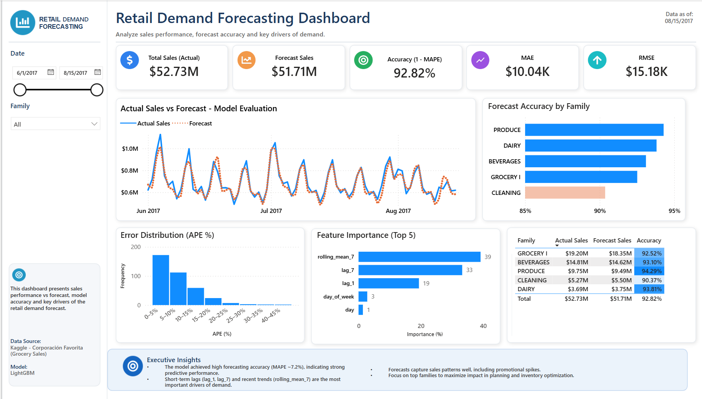

# Retail Demand Forecasting 📈

### End-to-end demand forecasting for grocery retail — from raw transactional data to a business-ready decision tool.


> A complete machine-learning pipeline that predicts daily grocery sales at the product-family level, reaching **92.8% forecast accuracy (MAPE ≈ 7.2%)** and a **~40% reduction in RMSE versus a seasonal baseline** — surfaced through an interactive Power BI dashboard designed for inventory and planning decisions.



---

## 🎯 Business Problem

Forecasting error is expensive on both sides. **Overstock** ties up cash and drives waste in perishable categories; **stockouts** cost sales and erode customer trust. For a large grocery retailer moving tens of millions of dollars in sales, even a few points of forecast accuracy translate into meaningful savings in inventory and planning.

This project builds a daily demand forecast for **Corporación Favorita**, a major Ecuadorian grocery chain, at the **product-family level** — the granularity at which purchasing and replenishment decisions are actually made. The goal is not just a model with good error metrics, but a **decision tool a planner can open and act on**.

---

## 📊 Results at a Glance

| Metric | Value | What it means |
| :--- | :--- | :--- |
| **Forecast Accuracy (1 − MAPE)** | **92.82%** | On average, forecasts land within ~7% of actual sales |
| **MAPE** | **≈ 7.2%** | Low percentage error across families |
| **RMSE** | **$15,176** | Typical error magnitude in absolute terms |
| **MAE** | **$10,040** | Median-scale absolute error |
| **R²** | **0.97** | The model explains 97% of demand variance |
| **Total Actual vs Forecast** | **$52.73M vs $51.71M** | Aggregate forecast within ~2% of realized sales |

### Model Benchmarking

Every result was measured against progressively stronger baselines using **time-based validation** (no future leakage), so the improvement reflects real predictive skill, not overfitting.

| Model | Role | Outcome |
| :--- | :--- | :--- |
| Seasonal Naive | Baseline | Reference error to beat |
| Prophet | Statistical time-series benchmark | Captured trend/seasonality, weaker on short-term spikes |
| **LightGBM** | **Champion (deployed)** | **~40% lower RMSE than the seasonal baseline** |

### Accuracy by Product Family

| Family | Actual Sales | Forecast Sales | Accuracy |
| :--- | ---: | ---: | ---: |
| Grocery I | $19.20M | $18.35M | 92.52% |
| Beverages | $14.81M | $14.62M | 93.10% |
| Produce | $9.75M | $9.49M | 94.29% |
| Cleaning | $5.27M | $5.50M | 90.37% |
| Dairy | $3.69M | $3.75M | 93.81% |
| **Total** | **$52.73M** | **$51.71M** | **92.82%** |

---

## 🔑 What Drives Demand

The dashboard exposes **feature importance** so the model's logic is transparent to the business, not a black box. Short-term momentum dominates:

| Rank | Feature | Importance | Interpretation |
| :--- | :--- | ---: | :--- |
| 1 | `rolling_mean_7` | 39% | 7-day rolling average — recent demand level |
| 2 | `lag_7` | 33% | Same weekday last week — weekly rhythm |
| 3 | `lag_1` | 19% | Previous day — short-term momentum |
| 4 | `day_of_week` | 3% | Weekly seasonality |
| 5 | `day` | 1% | Calendar position |

**Takeaway:** recent trend and weekly seasonality explain the vast majority of demand — an insight that directly informs how far ahead planners can trust the forecast.

---

## 🧠 Approach & Pipeline

The project follows a full, reproducible analytics workflow:

1. **Data acquisition & cleaning** — ingest raw Corporación Favorita sales data, handle missing values, resolve duplicates, and validate against expected ranges.
2. **Exploratory Data Analysis** — characterize demand distributions, seasonality, promotional spikes, and per-family behavior.
3. **Feature engineering** — build the predictive signal:
   - **Lag features** (`lag_1`, `lag_7`) to encode short-term and weekly momentum
   - **Rolling statistics** (`rolling_mean_7`) to capture recent demand level
   - **Cyclical calendar encodings** (day, day-of-week) to represent seasonality without artificial ordinal gaps
4. **Modeling** — benchmark a Seasonal Naive baseline and a Prophet time-series model, then train and tune a **LightGBM** gradient-boosting regressor, validated with a time-based split to prevent leakage.
5. **Evaluation** — assess with RMSE, MAE, MAPE, and R²; analyze the **error distribution (APE %)** and break down accuracy by product family to find where the model is strong and where it needs attention.
6. **Business layer** — export predictions and build an interactive **Power BI dashboard** with date and family filters, actual-vs-forecast tracking, and executive insights.

---

## 🛠️ Tech Stack

| Area | Tools |
| :--- | :--- |
| Language | Python 3.10+ |
| Data wrangling | pandas, numpy |
| Modeling | LightGBM, Prophet, scikit-learn |
| Visualization (analysis) | matplotlib, seaborn |
| Business intelligence | Power BI |
| Environment | Jupyter Notebook |

---

## 📁 Repository Structure

```
retail-demand-forecasting/
├── data/
│   ├── raw/                          # Kaggle Corporación Favorita source files
│   └── processed/                    # Cleaned & feature-engineered datasets
├── notebooks/
│   ├── 01_eda_feature_engineering.ipynb   # EDA + feature construction
│   └── 02_modeling_lightgbm.ipynb         # Baselines, LightGBM, evaluation
├── reports/
│   ├── dashboard.png                 # Power BI dashboard (preview above)
│   ├── predictions.csv               # Model output feeding the dashboard
│   └── retail_forecasting.pbix       # Power BI report file
├── requirements.txt
└── README.md
```

> *Adjust the file names above to match your actual notebooks and exports.*

---

## ▶️ How to Reproduce

```bash
# 1. Clone the repository
git clone https://github.com/<your-username>/retail-demand-forecasting.git
cd retail-demand-forecasting

# 2. Create and activate a virtual environment
python -m venv venv
source venv/bin/activate        # On Windows: venv\Scripts\activate

# 3. Install dependencies
pip install -r requirements.txt

# 4. Download the dataset
#    Kaggle → "Corporación Favorita Grocery Sales Forecasting"
#    and place the files in data/raw/

# 5. Run the notebooks in order
jupyter notebook notebooks/01_eda_feature_engineering.ipynb
jupyter notebook notebooks/02_modeling_lightgbm.ipynb

# 6. Open reports/retail_forecasting.pbix in Power BI Desktop
```

---

## 💡 What This Project Demonstrates

- **End-to-end ownership** — from raw data to a stakeholder-facing product, not just an isolated notebook.
- **Rigorous validation** — time-based splits and progressive baselines, so reported gains reflect genuine predictive skill.
- **Feature engineering that matters** — lag, rolling, and cyclical features that measurably drive performance.
- **Gradient boosting in practice** — a tuned LightGBM model delivering a ~40% RMSE improvement over baseline.
- **Error analysis, not just headline metrics** — APE distribution and per-family accuracy to understand *where* and *why* the model works.
- **Translating models into decisions** — an interactive BI layer that turns predictions into inventory and planning insight.

---

## 👤 Author

**Raúl Cuéllar** — Data Analyst with hands-on enterprise experience in SAP HANA, SQL, and production data systems, combining ML/statistics with real-world business context.

- **LinkedIn** — [raúl-eduardo-garcía-cuéllar](https://www.linkedin.com/in/raúl-eduardo-garcía-cuéllar-5843bb40aL)
- **GitHub** — [github.com/Edugar97](https://github.com/Edugar97)
- **Email** — [raulcuellar.rc97@gmail.com](mailto:raulcuellar.rc97@gmail.com)
---

## 📄 License

Distributed under the MIT License. See `LICENSE` for details.

*Data source: [Corporación Favorita Grocery Sales Forecasting](https://www.kaggle.com/c/favorita-grocery-sales-forecasting) (Kaggle).*