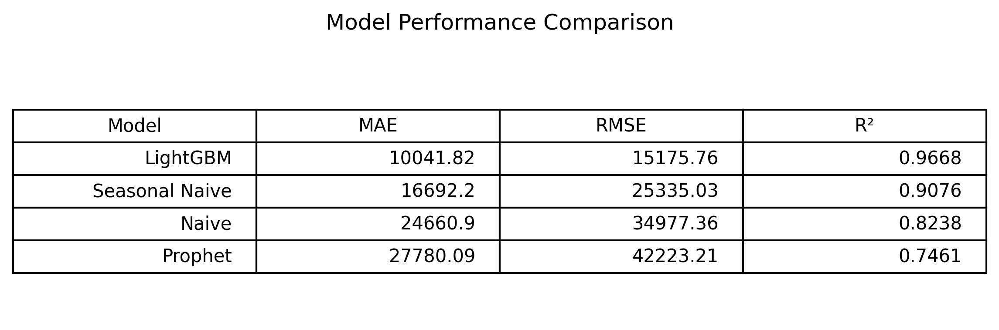
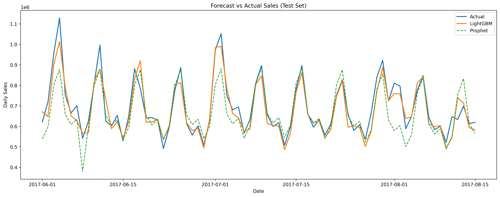

# Retail Demand Forecasting using Machine Learning

## Project Overview

This project develops an end-to-end retail demand forecasting solution using historical sales data from a multi-store retail company.

The objective is to predict future daily sales for the five highest-selling product families by combining exploratory data analysis, feature engineering, machine learning models, and business-oriented visualizations.

The project follows a complete Data Science workflow, from raw data exploration to a production-ready forecasting model.

---

## Business Problem

Accurate demand forecasting helps retailers:

- Reduce stock shortages
- Minimize inventory costs
- Improve replenishment planning
- Optimize promotional strategies
- Support business decision-making

Instead of forecasting aggregated sales, this project forecasts the **Top 5 product families individually**, providing more realistic and actionable business insights.

---

## Dataset

**Source**

Corporación Favorita Grocery Sales Forecasting (Kaggle)

Main characteristics:

- More than **3 million observations**
- Daily sales
- 54 stores
- 33 product families
- Period:
  - January 2013
  - August 2017

---

# Project Structure

```text
retail-demand-forecasting/

├── data/
│
├── images/
│   ├── model_comparison.png
│   ├── feature_importance.png
│   └── forecast_vs_actual.png
│
├── models/
│   ├── lightgbm_model.pkl
│   └── model_metadata.json
│
├── notebooks/
│   ├── 01_data_understanding.ipynb
│   └── 02_modeling.ipynb
│
├── reports/
│   └── predictions.csv
│
├── README.md
└── requirements.txt
```

---

# Exploratory Data Analysis

Main findings:

- No missing values
- No duplicate records
- Sales increased consistently over time
- Strong weekly seasonality
- December has the highest average sales
- Promotions significantly increase sales
- Top 10 product families generate approximately **93% of total sales**
- Sales history is highly predictive of future demand

---

# Feature Engineering

Time-series features were created independently for each product family.

Features include:

- Lag 1
- Lag 7
- Lag 30
- Rolling Mean 7
- Rolling Mean 30
- Year
- Month
- Day
- Day of Week
- Week of Year
- Quarter
- Weekend Indicator
- Promotion Indicator
- Cyclical Month Encoding (sin/cos)

---

# Modeling Approach

Temporal split:

- Training Set
- Validation Set
- Test Set

Models evaluated:

- Naive Forecast
- Seasonal Naive
- Prophet
- LightGBM

The final production model is **LightGBM**.

---

# Model Performance

| Model | MAE | RMSE | R² |
|------|------:|------:|------:|
| **LightGBM** | **10,041.82** | **15,175.76** | **0.9668** |
| Seasonal Naive | 16,692.20 | 25,335.03 | 0.9076 |
| Naive | 24,660.90 | 34,977.36 | 0.8238 |
| Prophet | 27,780.09 | 42,223.21 | 0.7461 |

LightGBM consistently outperformed all baseline and statistical forecasting models.

### Model Comparison

<p align="center">
  
</p>

---

# Feature Importance

The most influential predictors were:

1. Lag 7
2. Lag 1
3. Rolling Mean 30
4. Day of Week
5. Rolling Mean 7

This confirms the conclusions obtained during the exploratory data analysis.


---

# Forecast Results

The final LightGBM model successfully captures the weekly demand cycles across all five product families.

Future forecasts closely follow the actual sales while substantially reducing forecasting error compared to baseline models.

### Forecast vs Actual

<p align="center">
  
</p>

---

# Technologies Used

- Python
- Pandas
- NumPy
- Matplotlib
- Seaborn
- Scikit-learn
- LightGBM
- Prophet
- Joblib

---

# Repository Contents

✔ Exploratory Data Analysis

✔ Time Series Feature Engineering

✔ Baseline Models

✔ LightGBM Forecasting

✔ Prophet Comparison

✔ Model Evaluation

✔ Feature Importance

✔ Forecast Visualization

✔ Exported Production Model

---

# Future Improvements

- Hyperparameter Optimization (Optuna)
- Time Series Cross Validation
- Dashboard in Power BI / Tableau
- Streamlit Deployment
- Multi-step Forecasting

---

# Author

**Raul Garcia**

**Data Analyst | Business Intelligence | Machine Learning**

LinkedIn: *(Add your LinkedIn profile)*

GitHub: *(Add your GitHub profile)*